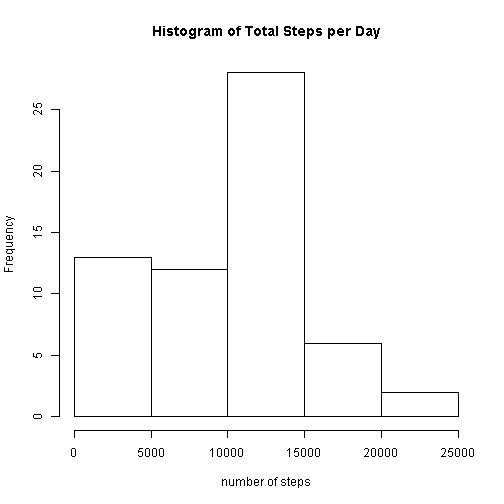
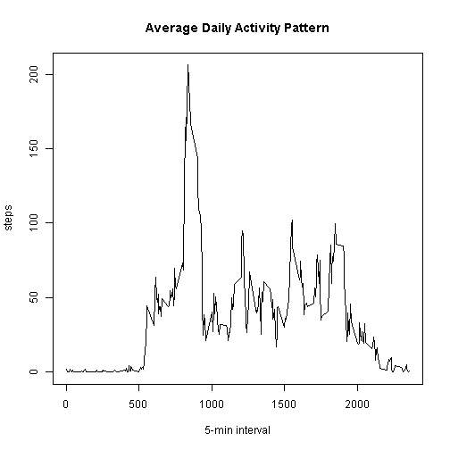
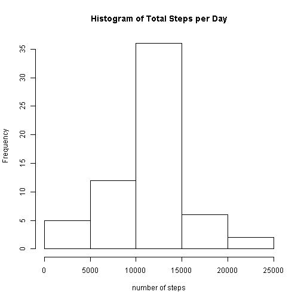
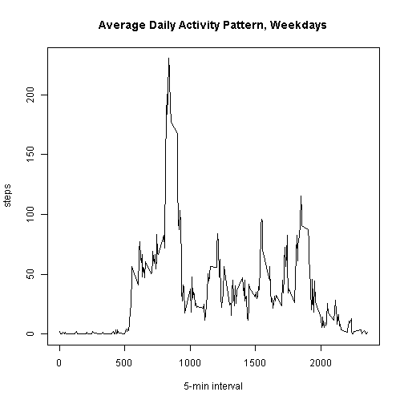
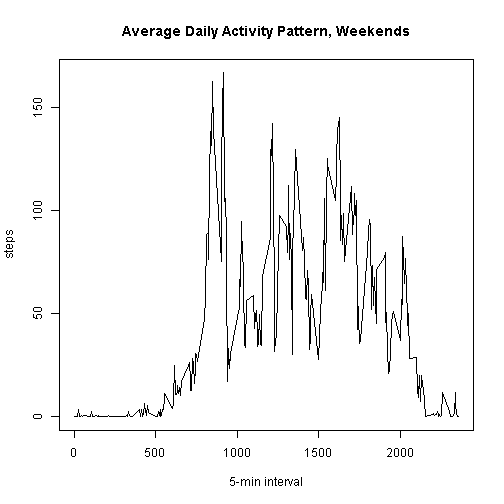

This is my submission for Reproducible Research Peer Assessment #1

Loading and preprocessing the data:
-------------------------------


```r
## load the data
activity <- read.csv("activity.csv")

##sum up total steps for each day
library(dplyr)
totalsteps <- activity %.% group_by(date) %.% summarise(total = sum(steps, na.rm = TRUE))
```

Mean total number of steps taken per day:
-------------------------------


```r
##create histogram of total number of steps taken per day
hist(totalsteps$total, main = "Histogram of Total Steps per Day", xlab = "number of steps")
```

 

```r
## calculate mean total steps
meansteps <- mean(totalsteps$total)
meansteps
```

```
## [1] 9354
```

```r
##calculate median total steps
mediansteps <- median(totalsteps$total)
mediansteps
```

```
## [1] 10395
```

Average daily activity pattern:
-------------------------------

```r
##calculate mean number of steps per interval 
meaninterval <- tapply(activity$steps, activity$interval, mean, na.rm = TRUE)

##plot the average steps per 5-minute interval
plot(meaninterval ~ unique(activity$interval), type = "l", xlab = "5-min interval", ylab = "steps", main = "Average Daily Activity Pattern")
```

 

```r
##find the interval with the maximum number of steps (the first number is the interval with the most steps)
which.max(meaninterval)
```

```
## 835 
## 104
```

Imputing missing values:
-------------------------------

```r
##calculate the number of missing values in the dataset
sum(is.na(activity))
```

```
## [1] 2304
```

```r
##create a new data frame identical to the original to add the imputed values to
activityfull <- activity

##for all NA values, replace with the average for that 5-min interval
for (i in 1:nrow(activity)){
    if(is.na(activity$steps[i])){
        activityfull$steps[i]<- meaninterval[[as.character(activity[i, "interval"])]]
    }
}

##sum up total steps for each day in new dataset with missing values imputed
library(dplyr)
fulltotalsteps <- activityfull %.% group_by(date) %.% summarise(total = sum(steps, na.rm = TRUE))

##create histogram of total number of steps taken per day with missing values imputed
hist(fulltotalsteps$total, main = "Histogram of Total Steps per Day", xlab = "number of steps")
```

 

```r
## calculate mean total steps with missing values imputed
fullmeansteps <- mean(fulltotalsteps$total)
fullmeansteps
```

```
## [1] 10766
```

```r
##calculate median total steps with missing values imputed
fullmediansteps <- median(fulltotalsteps$total)
fullmediansteps
```

```
## [1] 10766
```
Imputing values for the missing data increases the number of mean and median steps, which makes sense -  the missing values previously would have essentially counted as 0, but now that missing value has been replaced with a number.


Differences in weekday vs. weekend activity patterns:
-------------------------------

```r
##create a new column in the data to indicate the day of the week, initially setting all values to weekday
activityfull$dayofweek <- c("weekday")

##find days that are weekends and update the dayofweek column
activityfull[weekdays(as.Date(activityfull[, 2])) %in% c("Saturday", "Sunday", "saturday", "sunday"), ][4] <- c("weekend")

##create subsets of data for the weekends and the weekdays
activity_weekday <- subset(activityfull, activityfull$dayofweek == "weekday")
activity_weekend <- subset(activityfull, activityfull$dayofweek == "weekend")

##calculate mean number of steps per interval for weekday and weekend
meaninterval_weekday <- tapply(activity_weekday$steps, activity_weekday$interval, mean, na.rm = TRUE)
meaninterval_weekend <- tapply(activity_weekend$steps, activity_weekend$interval, mean, na.rm = TRUE)

##plot the average steps per 5-minute interval for weekday and weekend
plot(meaninterval_weekday ~ unique(activity_weekday$interval), type = "l", xlab = "5-min interval", ylab = "steps", main = "Average Daily Activity Pattern, Weekdays")
```

 

```r
plot(meaninterval_weekend ~ unique(activity_weekend$interval), type = "l", xlab = "5-min interval", ylab = "steps", main = "Average Daily Activity Pattern, Weekends")
```

 
